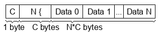

# Format A

Format A is a binary file format for storing numbers, which could also represent other things.

The file format consists of structures C, N, and D, where

* C is a 1-byte unsigned number that tells how many bytes each following number is. C should be larger than zero
* N is a C-byte number that tell the length of the following data
* D is the data, which is an array of N C-byte numbers

A structure of this format has a total size of 1+C+C\*N, or 1+C\*(N+1)
